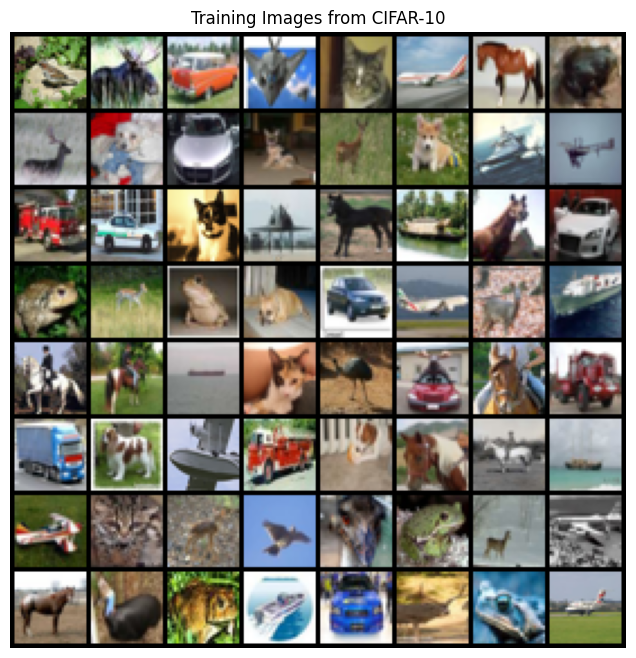

# DCGAN CIFAR-10 Results

## CIFAR-10 Dataset Samples
Examples from the CIFAR-10 dataset used to train the DCGAN model.

---

## GAN Training Progress
The generator gradually improves as training progresses across epochs.

---

## Final Generated Images (Epoch 50)
These are the images generated by the DCGAN after the final training epoch.

